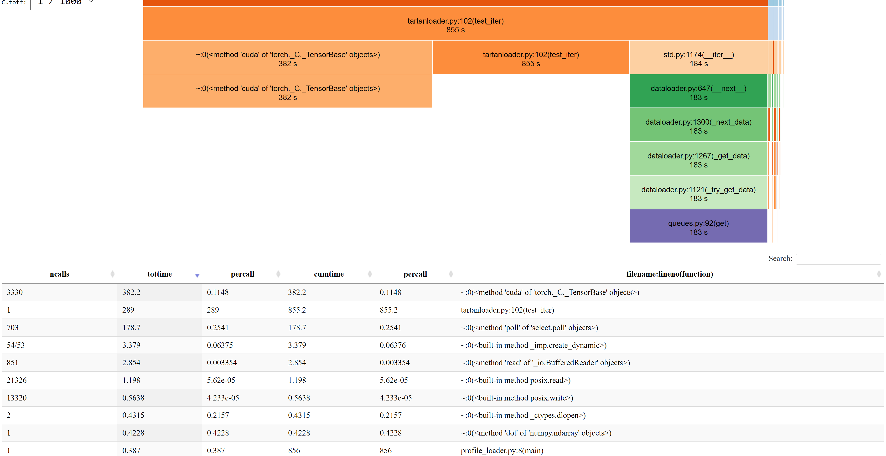

## dataloading benchmark on TartanAIR

To test performance of various data loading methods, we read all modalities from the abandoned factory environment of TartanAIR.
The modalities include: image_left, depth_left, flow, flow_mask, seg_left. Each item from the dataset (datapipe) is a video clip of length
16 from some trajectory, where each frame consists of tensors representing data of all modalities.

Three dataloading methods are tested:

- SeqRecord
- Original tartanair dataloader
- ffcv

### test method

Time of running one epoch is reported. Inside each iteration,

```
for key in batch:
    batch[key].cuda()
torch.cuda.synchronize()
```

### locally on vm

Local VM configuration: Standard NC6s v3 (6 vcpus, 112 GiB memory).

On local virtual machine, data access is taken care of by blobfuse.

| method                    | mins   | batch_size | num_workers | shuffle? (buffer size) | prefetch factor |
| ------------------------- | ------ | ---------- | ----------- | ---------------------- | --------------- |
| SeqRecord(iter)           | 18     | 32         | 4           | 100                    | 2               |
| SeqRecord(iter)           | 13     | 32         | 6           | 100                    | 2               |
| SeqRecord(map)            | 32     | 32         | 4           | False                  | 2               |
| SeqRecord(map)            | 10\*60 | 32         | 4           | True                   | 2               |
| original TartanAIR loader | 44     | 32         | 4           | False                  | 1               |
| original TartanAIR loader | 50     | 32         | 4           | True                   | 1               |

ffcv on tartanair with `seq_len=1` (ffcv is not naturally suited for reading clips from video),

| method | min | batch_size | num_workers | shuffle? | prefetch factor |
| ------ | --- | ---------- | ----------- | -------- | --------------- |
| ffcv   | 15  | 32         | 4           | random   | unknown         |

ffcv on tartanair with `seq_len=16` (Sai's seqence-ffcv version) has memory issues.

### AML with amulet

AML compute configuration: Standard_NC6s_v3 (6 cores, 112 GB RAM, 336 GB disk).

data download and caching is unknonw.

| method                    | mins  | batch_size | num_workers | shuffle? (buffer size) | prefetch factor |
| ------------------------- | ----- | ---------- | ----------- | ---------------------- | --------------- |
| SeqRecord                 | 18    | 32         | 4           | 100                    | 2               |
| original tartanAIR loader | 6\*60 | 32         | 4           | True                   | 1               |
| original tartanAIR loader | 50    | 32         | 4           | False                  | 1               |

ffcv with `seq_len=1`

| method | mins | batch_size | num_workers | shuffle (size)? | prefetch factor |
| ------ | ---- | ---------- | ----------- | --------------- | --------------- |
| ffcv   | 10   | 32         | 4           | quasi-random    | unkown          |

ffcv with `seq_len=16` has memory issue on aml also.

### local vm with blobfile

Reading data from storage account of azure directly using [blobfile](https://github.com/christopher-hesse/blobfile).

| method    | mins | batch_size | num_workers | shuffle (size)? | prefetch factor |
| --------- | ---- | ---------- | ----------- | --------------- | --------------- |
| SeqRecord | 45   | 32         | 4           | 100             | 2               |

### profiling native SeqRecord on local VM

The following result is obtained for SeqRecord with `num_workers=6` on local machines.


Majority of the computation time is spent on cuda operations:

1. cuda of torch tensor
1. select.poll (from datapipe?)
1. buffer reader
1. posix.read and posix.write

Why do we have posix write? We do not have any write operations. `io.open()` does not seem to be the bottleneck in this case?
