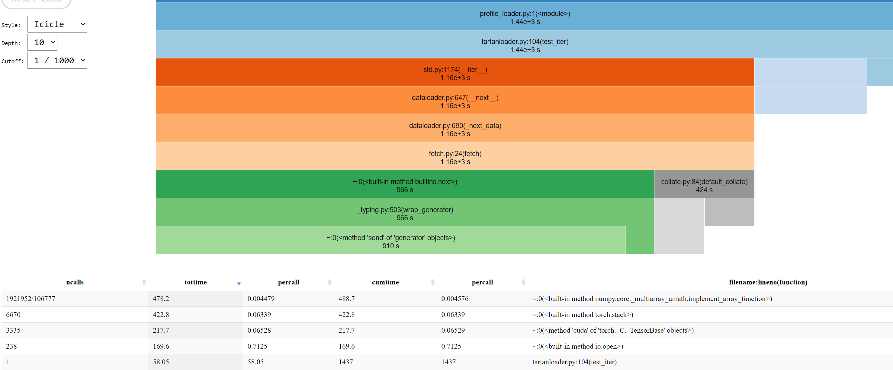

## dataloading benchmark on TartanAIR

To test performance of various data loading methods, we read all modalities from the abandoned factory environment of TartanAIR.
The modalities include: image_left, depth_left, flow, flow_mask, seg_left. Each item from the dataset (datapipe) is a video clip of length
16 from some trajectory, where each frame consists of tensors representing data of all modalities.

Three dataloading methods are tested:
* SeqRecord
* Original tartanair dataloader
* ffcv

### test method

Time of running one epoch is reported. Inside each iteration,
```
for key in batch:
    batch[key].cuda()
torch.cuda.synchronize()
```
### locally on vm 
On local virtual machine, data access is taken care of by blobfuse.


|method|mins|batch_size|num_workers| shuffle? (buffer size) | prefetch factor|
|---|--- |---| --- | --- | ---|
|SeqRecord(iter)|18| 32|4 | 100 | 2|
|SeqRecord(map)|32| 32|4 | False | 2|
|SeqRecord(map)|10*60| 32|4 | True | 2|
|original TartanAIR loader|  44   |32|4 | False| 1|
|original TartanAIR loader|  50   |32| 4| True | 1|

ffcv on tartanair with `sqe_len=1` (ffcv is not naturally suited for reading clips from video),

|method | min | batch_size | num_workers | shuffle? | prefetch factor |
|---| --- | --- | ---| ---| ---|
|ffcv|15 | 32 | 4| random | unknown|

ffcv on tartanair with `sqe_len=16` (Sai's seqence-ffcv version) has memory issues.

### aml with amulet
data download and caching is unknonw.

|method|mins | batch_size| num_workers | shuffle? (buffer size) | prefetch factor|
|---|---| ---| ---| ---| ---|
|original tartanAIR loader| 6*60 |32| 4| True | 1|
|original tartanAIR loader| 50 |32| 4| False | 1|
|SeqRecord | 18| 32 | 4 | 100| 2|


ffcv with `seg_len=1`
|method|mins | batch_size| num_workers | shuffle (size)? | prefetch factor|
|---|---| ---| ---| ---| ---|
|ffcv| 10 |32| 4| quasi-random | unkown|

ffcv with `seg_len=16` has memory issue on aml also.
### local vm with blobfile 
Reading data from storage account of azure directly using [blobfile](https://github.com/christopher-hesse/blobfile).
|method|mins | batch_size| num_workers | shuffle (size)? | prefetch factor|
|---|---| ---| ---| ---| ---|
|SeqRecord | 45| 32 | 4 | 100| 2|


### profile of native SeqRecord on local VM


Majority of the computation time is spent on numpy array and tensor operations:
1. implement_array_function
2. torch.stack
3. torch.tensor.cuda()
4. io.open()

While `implement_array_function` seems to be a dispatch function, disabling it won't accelerate the program and computation time will then be mostly consumed by other
numpy functions like `concatenate`. `io.open()` does not seem to be the bottleneck?